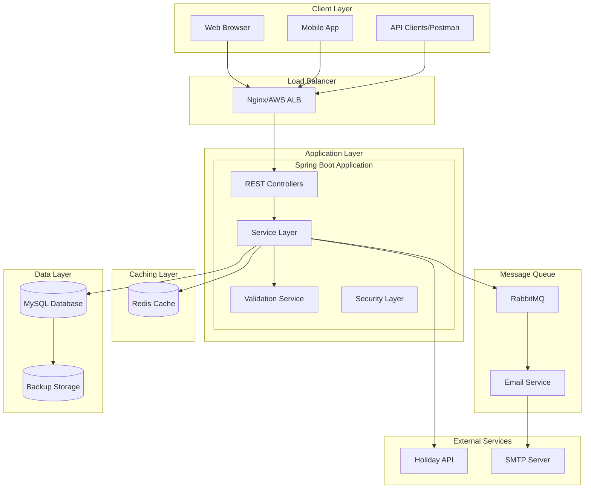
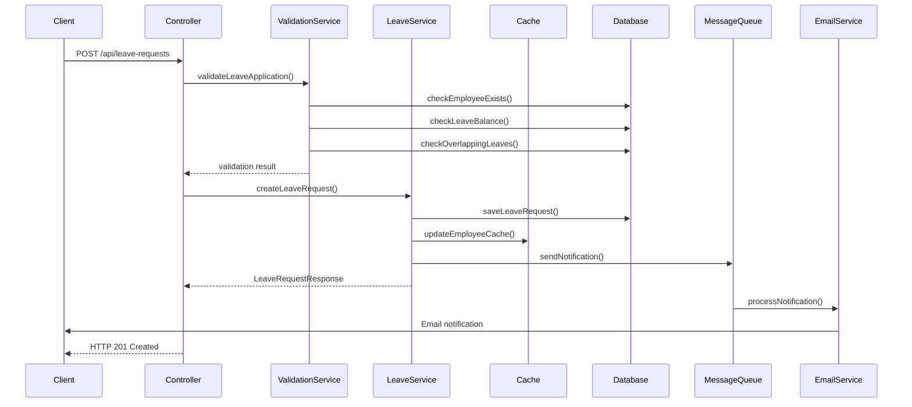
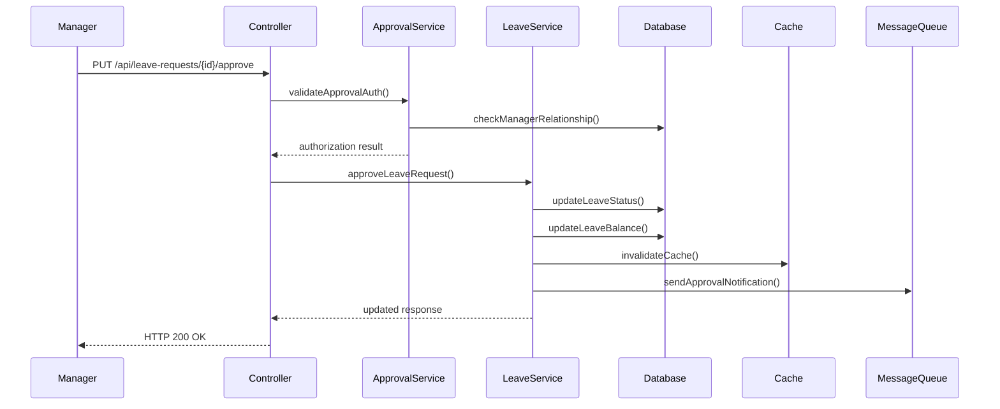
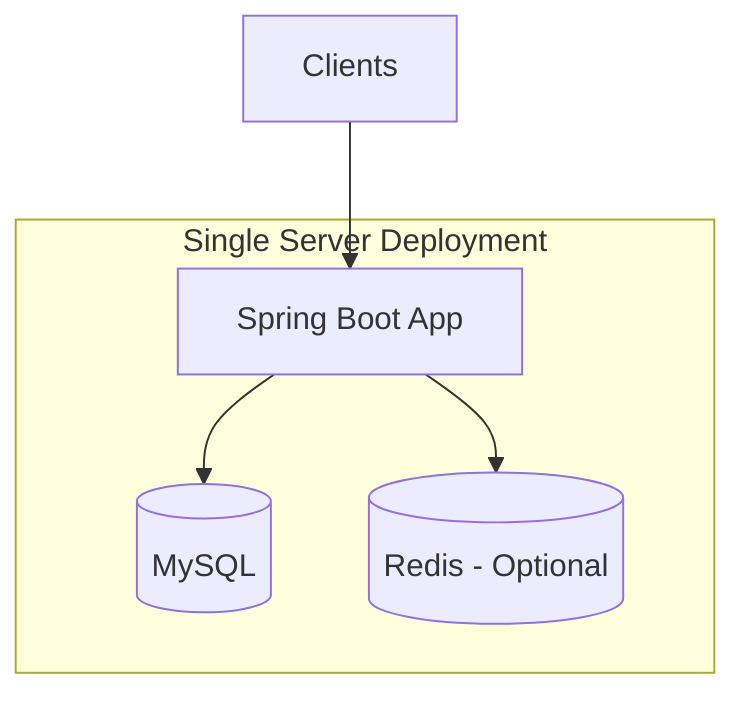
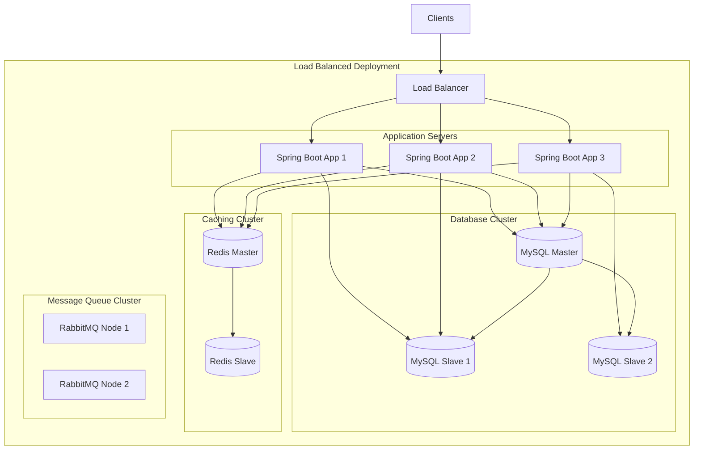

# Design Document

## Overview

The Mini Leave Management System is designed as a RESTful web application using Spring Boot framework with MySQL database. The system follows a layered architecture pattern with clear separation of concerns between presentation, business logic, and data access layers. The design emphasizes simplicity, maintainability, and scalability while providing comprehensive leave management functionality.

## Architecture

### Technology Stack
- **Backend Framework**: Spring Boot 3.x
- **Database**: MySQL 8.0
- **ORM**: Spring Data JPA with Hibernate
- **API Documentation**: Swagger/OpenAPI 3
- **Testing**: JUnit 5, Mockito, TestContainers
- **Build Tool**: Maven
- **Java Version**: Java 17+
- **Frontend**: React.js (recommended for future implementation)
- **Caching**: Redis (for scalability)
- **Message Queue**: RabbitMQ (for notifications)

### High-Level System Architecture



### Component Interaction Flow

#### 1. Leave Application Flow


#### 2. Leave Approval Flow


### Scalability Architecture (50 to 500 employees)

#### Current Architecture (50 employees)


#### Scaled Architecture (500 employees)


### Database Design and API Interaction

#### Database Schema Optimization for Scale
```sql
-- Optimized indexes for performance
CREATE INDEX idx_employee_id ON employees(employee_id);
CREATE INDEX idx_employee_manager ON employees(manager_id);
CREATE INDEX idx_leave_employee_date ON leave_requests(employee_id, start_date, end_date);
CREATE INDEX idx_leave_status_date ON leave_requests(status, created_at);
CREATE INDEX idx_balance_employee_type ON leave_balances(employee_id, leave_type, year);

-- Partitioning for large datasets
ALTER TABLE leave_requests 
PARTITION BY RANGE (YEAR(created_at)) (
    PARTITION p2023 VALUES LESS THAN (2024),
    PARTITION p2024 VALUES LESS THAN (2025),
    PARTITION p2025 VALUES LESS THAN (2026)
);
```

#### API Performance Optimizations

##### 1. Caching Strategy
```java
@Service
public class LeaveService {
    
    @Cacheable(value = "employeeLeaveBalance", key = "#employeeId")
    public List<LeaveBalanceResponse> getEmployeeLeaveBalance(String employeeId) {
        // Database query with caching
    }
    
    @CacheEvict(value = "employeeLeaveBalance", key = "#request.employeeId")
    public LeaveRequestResponse createLeaveRequest(LeaveApplicationRequest request) {
        // Invalidate cache when balance changes
    }
}
```

##### 2. Database Connection Pooling
```yaml
# application.yml
spring:
  datasource:
    hikari:
      maximum-pool-size: 20
      minimum-idle: 5
      connection-timeout: 30000
      idle-timeout: 600000
      max-lifetime: 1800000
```

##### 3. Pagination for Large Datasets
```java
@GetMapping("/api/leave-requests")
public ResponseEntity<Page<LeaveRequestResponse>> getLeaveRequests(
    @RequestParam(defaultValue = "0") int page,
    @RequestParam(defaultValue = "20") int size,
    @RequestParam(required = false) String employeeId) {
    
    Pageable pageable = PageRequest.of(page, size);
    Page<LeaveRequestResponse> requests = leaveService.getLeaveRequests(employeeId, pageable);
    return ResponseEntity.ok(requests);
}
```

### Scalability Considerations

#### 1. Horizontal Scaling
- **Stateless Application**: Spring Boot apps are stateless, enabling easy horizontal scaling
- **Load Balancing**: Distribute requests across multiple application instances
- **Database Read Replicas**: Separate read and write operations

#### 2. Performance Optimizations
- **Connection Pooling**: Efficient database connection management
- **Caching**: Redis for frequently accessed data (employee details, leave balances)
- **Async Processing**: Message queues for email notifications
- **Database Indexing**: Optimized queries for large datasets

#### 3. Monitoring and Observability
```java
// Metrics and monitoring
@RestController
public class HealthController {
    
    @Autowired
    private MeterRegistry meterRegistry;
    
    @GetMapping("/actuator/health")
    public ResponseEntity<Map<String, String>> health() {
        // Custom health checks
        meterRegistry.counter("health.check.count").increment();
        return ResponseEntity.ok(Map.of("status", "UP"));
    }
}
```

#### 4. Resource Estimation for 500 Employees

| Component | Current (50 employees) | Scaled (500 employees) |
|-----------|----------------------|----------------------|
| **Application Servers** | 1 instance (2 CPU, 4GB RAM) | 3 instances (4 CPU, 8GB RAM each) |
| **Database** | Single MySQL (4 CPU, 8GB RAM) | Master + 2 Slaves (8 CPU, 16GB RAM each) |
| **Cache** | Optional Redis | Redis Cluster (2 nodes, 2GB RAM each) |
| **Storage** | 10GB | 100GB (with partitioning) |
| **Network** | 100 Mbps | 1 Gbps |

#### 5. Deployment Architecture
```yaml
# Docker Compose for scaled deployment
version: '3.8'
services:
  nginx:
    image: nginx:alpine
    ports:
      - "80:80"
    depends_on:
      - app1
      - app2
      - app3
  
  app1:
    image: leave-management:latest
    environment:
      - SPRING_PROFILES_ACTIVE=production
      - DATABASE_URL=jdbc:mysql://mysql-master:3306/leave_db
    depends_on:
      - mysql-master
      - redis
  
  app2:
    image: leave-management:latest
    environment:
      - SPRING_PROFILES_ACTIVE=production
      - DATABASE_URL=jdbc:mysql://mysql-master:3306/leave_db
  
  app3:
    image: leave-management:latest
    environment:
      - SPRING_PROFILES_ACTIVE=production
      - DATABASE_URL=jdbc:mysql://mysql-master:3306/leave_db
  
  mysql-master:
    image: mysql:8.0
    environment:
      - MYSQL_ROOT_PASSWORD=password
      - MYSQL_DATABASE=leave_db
    volumes:
      - mysql_data:/var/lib/mysql
  
  redis:
    image: redis:alpine
    command: redis-server --appendonly yes
    volumes:
      - redis_data:/data
```

This architecture ensures the system can handle growth from 50 to 500 employees while maintaining performance and reliability.

## Project README

### Mini Leave Management System

A comprehensive leave management system built with Spring Boot and MySQL, designed for small to medium-sized organizations to efficiently manage employee leave requests, approvals, and balance tracking.

#### Features
- Employee management with hierarchical manager relationships
- Leave application with multiple leave types and durations
- Automated approval workflows with delegation support
- Real-time leave balance tracking with working day calculations
- Emergency and backdated leave request handling
- Email notifications for all leave activities
- Comprehensive reporting and audit trails
- REST API with Swagger documentation

#### Technology Stack
- **Backend**: Java 17, Spring Boot 3.x, Spring Data JPA
- **Database**: MySQL 8.0
- **Caching**: Redis (optional for scaling)
- **Message Queue**: RabbitMQ (for notifications)
- **Testing**: JUnit 5, Mockito, TestContainers
- **Documentation**: Swagger/OpenAPI 3
- **Build Tool**: Maven

### Setup Instructions

#### Prerequisites
- Java 17 or higher
- Maven 3.6+
- MySQL 8.0
- Redis (optional, for caching)
- Git

#### Local Development Setup

1. **Clone the Repository**
   ```bash
   git clone https://github.com/your-org/mini-leave-management-system.git
   cd mini-leave-management-system
   ```

2. **Database Setup**
   ```sql
   -- Create database
   CREATE DATABASE leave_management_db;
   
   -- Create user (optional)
   CREATE USER 'leave_user'@'localhost' IDENTIFIED BY 'leave_password';
   GRANT ALL PRIVILEGES ON leave_management_db.* TO 'leave_user'@'localhost';
   FLUSH PRIVILEGES;
   ```

3. **Configure Application Properties**
   ```properties
   # src/main/resources/application-local.properties
   spring.datasource.url=jdbc:mysql://localhost:3306/leave_management_db
   spring.datasource.username=leave_user
   spring.datasource.password=leave_password
   
   # JPA Configuration
   spring.jpa.hibernate.ddl-auto=create-drop
   spring.jpa.show-sql=true
   spring.jpa.properties.hibernate.format_sql=true
   
   # Email Configuration (optional)
   spring.mail.host=smtp.gmail.com
   spring.mail.port=587
   spring.mail.username=your-email@gmail.com
   spring.mail.password=your-app-password
   ```

4. **Build and Run**
   ```bash
   # Build the project
   mvn clean compile
   
   # Run tests
   mvn test
   
   # Start the application
   mvn spring-boot:run -Dspring-boot.run.profiles=local
   ```

5. **Access the Application**
   - API Base URL: `http://localhost:8080/api`
   - Swagger UI: `http://localhost:8080/swagger-ui.html`
   - Health Check: `http://localhost:8080/actuator/health`

#### Docker Setup (Alternative)

1. **Using Docker Compose**
   ```yaml
   # docker-compose.yml
   version: '3.8'
   services:
     app:
       build: .
       ports:
         - "8080:8080"
       environment:
         - SPRING_PROFILES_ACTIVE=docker
         - DATABASE_URL=jdbc:mysql://mysql:3306/leave_db
       depends_on:
         - mysql
         - redis
     
     mysql:
       image: mysql:8.0
       environment:
         MYSQL_ROOT_PASSWORD: rootpassword
         MYSQL_DATABASE: leave_db
         MYSQL_USER: leave_user
         MYSQL_PASSWORD: leave_password
       ports:
         - "3306:3306"
       volumes:
         - mysql_data:/var/lib/mysql
     
     redis:
       image: redis:alpine
       ports:
         - "6379:6379"
   
   volumes:
     mysql_data:
   ```

2. **Run with Docker**
   ```bash
   docker-compose up -d
   ```

#### API Testing

1. **Using Postman**
   - Import the Swagger JSON from `http://localhost:8080/v3/api-docs`
   - Use the provided collection for testing all endpoints

2. **Using cURL Examples**
   ```bash
   # Create an employee
   curl -X POST http://localhost:8080/api/employees \
     -H "Content-Type: application/json" \
     -d '{
       "employeeId": "EMP001",
       "name": "John Doe",
       "email": "john.doe@company.com",
       "department": "Engineering",
       "joiningDate": "2023-01-15"
     }'
   
   # Apply for leave
   curl -X POST http://localhost:8080/api/leave-requests \
     -H "Content-Type: application/json" \
     -d '{
       "employeeId": "EMP001",
       "leaveType": "VACATION",
       "startDate": "2024-03-15",
       "endDate": "2024-03-17",
       "duration": "FULL_DAY",
       "reason": "Family vacation"
     }'
   
   # Check leave balance
   curl -X GET http://localhost:8080/api/leave-balances/employee/EMP001
   ```

### Development Assumptions

#### Business Logic Assumptions
1. **Working Days**: Monday to Friday are considered working days; weekends are excluded from leave calculations
2. **Leave Year**: Calendar year (January to December) is used for leave balance calculations
3. **Default Leave Allocation**: New employees get 20 vacation days, 10 sick days, and 5 personal days per year
4. **Manager Hierarchy**: Each employee can have only one direct manager
5. **Emergency Leave Limit**: Auto-approval is limited to 2 days for emergency leaves
6. **Backdated Requests**: Allowed up to 30 days in the past with proper justification
7. **Half-Day Calculation**: Half-day leaves count as 0.5 days against the balance

#### Technical Assumptions
1. **Single Tenant**: System designed for single organization use
2. **Email Notifications**: SMTP server is available for sending notifications
3. **Time Zone**: All dates are handled in system default timezone
4. **Authentication**: Basic authentication assumed (can be extended to OAuth2/JWT)
5. **File Storage**: No document attachments for leave requests in MVP
6. **Audit Logging**: Basic audit trail through entity timestamps
7. **Data Retention**: No automatic data archival/deletion policies

#### Integration Assumptions
1. **Holiday API**: External holiday service integration is optional
2. **HR System**: No integration with existing HR/payroll systems
3. **Active Directory**: No LDAP/AD integration for user management
4. **Mobile App**: API-first design supports future mobile app development

### Edge Cases Handled

#### Date and Time Edge Cases
- ✅ **End date before start date**: Validation prevents invalid date ranges
- ✅ **Leave before joining date**: System prevents applications before employee joining date
- ✅ **Past date applications**: Backdated requests allowed with justification
- ✅ **Weekend overlap**: Weekends excluded from leave balance calculations
- ✅ **Public holiday overlap**: Framework ready for holiday API integration
- ✅ **Year-end transitions**: Leave balance calculations handle year boundaries

#### Leave Balance Edge Cases
- ✅ **Insufficient balance**: Prevents applications exceeding available days
- ✅ **Negative balance**: System ensures balance never goes below zero
- ✅ **Uninitialized balance**: Handles employees without leave balance records
- ✅ **Half-day calculations**: Proper fractional day handling (0.5, 1.0)
- ✅ **Concurrent applications**: Database constraints prevent double-booking

#### Employee Management Edge Cases
- ✅ **Employee not found**: Proper error handling for invalid employee IDs
- ✅ **Duplicate employee ID**: Unique constraints prevent duplicates
- ✅ **Manager not found**: Validation ensures manager exists before assignment
- ✅ **Circular manager relationships**: Validation prevents manager loops
- ✅ **Self-approval prevention**: Employees cannot approve their own requests

#### Approval Workflow Edge Cases
- ✅ **Manager on leave**: Delegation to alternate approvers (manager's manager or HR)
- ✅ **Multiple pending requests**: System handles multiple requests per employee
- ✅ **Emergency leave auto-approval**: Same-day emergency leaves up to 2 days
- ✅ **Request modification**: Prevents changes to approved/rejected requests
- ✅ **Overlapping requests**: Validation prevents conflicting leave periods

#### System Edge Cases
- ✅ **Database connectivity**: Graceful error handling for DB failures
- ✅ **Invalid input validation**: Comprehensive input validation with meaningful errors
- ✅ **Concurrent request handling**: Thread-safe operations with proper locking
- ✅ **Large dataset pagination**: Efficient handling of large result sets
- ✅ **Cache invalidation**: Proper cache management for data consistency

### Potential Areas for Improvement

#### Short-term Improvements (Next 3 months)
1. **Authentication & Authorization**
   - Implement JWT-based authentication
   - Role-based access control (Employee, Manager, HR, Admin)
   - API rate limiting and security headers

2. **Enhanced Notifications**
   - SMS notifications for urgent requests
   - In-app notification system
   - Customizable notification preferences

3. **Reporting Enhancements**
   - Advanced analytics dashboard
   - Leave pattern analysis
   - Department-wise utilization reports
   - Export to Excel/PDF formats

4. **Mobile Responsiveness**
   - Progressive Web App (PWA) support
   - Mobile-optimized API responses
   - Push notifications

#### Medium-term Improvements (3-6 months)
1. **Advanced Leave Types**
   - Compensatory off (comp-off) for overtime
   - Maternity/Paternity leave with special rules
   - Sabbatical and unpaid leave support
   - Custom leave types per department

2. **Integration Capabilities**
   - Calendar integration (Google Calendar, Outlook)
   - Slack/Teams bot for leave requests
   - Payroll system integration
   - LDAP/Active Directory integration

3. **Workflow Enhancements**
   - Multi-level approval workflows
   - Conditional approval rules
   - Bulk approval capabilities
   - Leave request templates

4. **Performance Optimizations**
   - Database query optimization
   - Advanced caching strategies
   - Async processing for heavy operations
   - Database connection pooling

#### Long-term Improvements (6+ months)
1. **AI/ML Features**
   - Leave pattern prediction
   - Optimal team coverage suggestions
   - Anomaly detection for leave abuse
   - Smart leave recommendations

2. **Advanced Analytics**
   - Predictive analytics for resource planning
   - Leave trend analysis
   - Employee satisfaction metrics
   - Burnout risk assessment

3. **Enterprise Features**
   - Multi-tenant architecture
   - Advanced audit logging
   - Data encryption at rest
   - Compliance reporting (GDPR, etc.)

4. **Scalability Enhancements**
   - Microservices architecture
   - Event-driven architecture
   - Cloud-native deployment
   - Auto-scaling capabilities

#### Technical Debt and Refactoring
1. **Code Quality**
   - Increase test coverage to 90%+
   - Implement mutation testing
   - Code quality gates with SonarQube
   - Performance testing with JMeter

2. **Documentation**
   - API documentation with examples
   - Architecture decision records (ADRs)
   - Deployment guides for different environments
   - User manuals and training materials

3. **DevOps Improvements**
   - CI/CD pipeline with automated testing
   - Infrastructure as Code (Terraform)
   - Monitoring and alerting (Prometheus, Grafana)
   - Log aggregation and analysis

### Contributing
1. Fork the repository
2. Create a feature branch (`git checkout -b feature/amazing-feature`)
3. Commit your changes (`git commit -m 'Add some amazing feature'`)
4. Push to the branch (`git push origin feature/amazing-feature`)
5. Open a Pull Request

### License
This project is licensed under the MIT License - see the [LICENSE.md](LICENSE.md) file for details.

### Support
For support and questions:
- Create an issue in the GitHub repository
- Email: support@yourcompany.com
- Documentation: [Wiki](https://github.com/your-org/mini-leave-management-system/wiki)

## Components and Interfaces

### Core Entities

#### Employee Entity
```java
@Entity
@Table(name = "employees")
public class Employee {
    @Id
    @GeneratedValue(strategy = GenerationType.IDENTITY)
    private Long id;
    
    @Column(unique = true, nullable = false)
    private String employeeId;
    
    @Column(nullable = false)
    private String name;
    
    @Column(unique = true, nullable = false)
    private String email;
    
    @Column(nullable = false)
    private String department;
    
    @Column(nullable = false)
    private LocalDate joiningDate;
    
    @ManyToOne
    @JoinColumn(name = "manager_id")
    private Employee manager;
    
    @OneToMany(mappedBy = "employee", cascade = CascadeType.ALL)
    private List<LeaveBalance> leaveBalances;
    
    @OneToMany(mappedBy = "employee", cascade = CascadeType.ALL)
    private List<LeaveRequest> leaveRequests;
}
```

#### Leave Request Entity
```java
@Entity
@Table(name = "leave_requests")
public class LeaveRequest {
    @Id
    @GeneratedValue(strategy = GenerationType.IDENTITY)
    private Long id;
    
    @Column(unique = true, nullable = false)
    private String requestId;
    
    @ManyToOne
    @JoinColumn(name = "employee_id", nullable = false)
    private Employee employee;
    
    @Enumerated(EnumType.STRING)
    private LeaveType leaveType;
    
    @Column(nullable = false)
    private LocalDate startDate;
    
    @Column(nullable = false)
    private LocalDate endDate;
    
    @Enumerated(EnumType.STRING)
    private LeaveDuration duration = LeaveDuration.FULL_DAY;
    
    @Column(nullable = false)
    private Double totalDays; // Calculated field: working days * duration
    
    private String reason;
    private String comments;
    
    @Enumerated(EnumType.STRING)
    private LeaveStatus status = LeaveStatus.PENDING;
    
    @Column
    private Boolean isEmergencyLeave = false;
    
    @Column
    private Boolean isBackdated = false;
    
    @ManyToOne
    @JoinColumn(name = "approved_by")
    private Employee approvedBy;
    
    private String rejectionReason;
    
    @CreationTimestamp
    private LocalDateTime createdAt;
    
    @UpdateTimestamp
    private LocalDateTime updatedAt;
    
    // Helper method to check if application is same-day
    public boolean isSameDayApplication() {
        return startDate.equals(LocalDate.now()) || startDate.isBefore(LocalDate.now());
    }
}
```

#### Leave Balance Entity
```java
@Entity
@Table(name = "leave_balances")
public class LeaveBalance {
    @Id
    @GeneratedValue(strategy = GenerationType.IDENTITY)
    private Long id;
    
    @ManyToOne
    @JoinColumn(name = "employee_id", nullable = false)
    private Employee employee;
    
    @Enumerated(EnumType.STRING)
    private LeaveType leaveType;
    
    @Column(nullable = false)
    private Integer totalDays;
    
    @Column(nullable = false)
    private Integer usedDays = 0;
    
    @Column(nullable = false)
    private Integer availableDays;
    
    private Integer year;
}
```

### REST API Endpoints

#### Employee Management API
```java
@RestController
@RequestMapping("/api/employees")
public class EmployeeController {
    
    @PostMapping
    public ResponseEntity<EmployeeResponse> createEmployee(@Valid @RequestBody CreateEmployeeRequest request);
    
    @GetMapping("/{employeeId}")
    public ResponseEntity<EmployeeResponse> getEmployee(@PathVariable String employeeId);
    
    @GetMapping
    public ResponseEntity<List<EmployeeResponse>> getAllEmployees();
    
    @PutMapping("/{employeeId}")
    public ResponseEntity<EmployeeResponse> updateEmployee(@PathVariable String employeeId, 
                                                          @Valid @RequestBody UpdateEmployeeRequest request);
    
    @DeleteMapping("/{employeeId}")
    public ResponseEntity<Void> deleteEmployee(@PathVariable String employeeId);
}
```

#### Leave Request API
```java
@RestController
@RequestMapping("/api/leave-requests")
public class LeaveRequestController {
    
    @PostMapping
    public ResponseEntity<LeaveRequestResponse> applyForLeave(@Valid @RequestBody LeaveApplicationRequest request);
    
    @GetMapping("/employee/{employeeId}")
    public ResponseEntity<List<LeaveRequestResponse>> getEmployeeLeaveRequests(@PathVariable String employeeId);
    
    @GetMapping("/pending")
    public ResponseEntity<List<LeaveRequestResponse>> getPendingRequests(@RequestParam String managerId);
    
    @PutMapping("/{requestId}/approve")
    public ResponseEntity<LeaveRequestResponse> approveLeaveRequest(@PathVariable String requestId,
                                                                   @Valid @RequestBody ApprovalRequest request);
    
    @PutMapping("/{requestId}/reject")
    public ResponseEntity<LeaveRequestResponse> rejectLeaveRequest(@PathVariable String requestId,
                                                                  @Valid @RequestBody RejectionRequest request);
}
```

#### Leave Balance API
```java
@RestController
@RequestMapping("/api/leave-balances")
public class LeaveBalanceController {
    
    @GetMapping("/employee/{employeeId}")
    public ResponseEntity<List<LeaveBalanceResponse>> getEmployeeLeaveBalance(@PathVariable String employeeId);
    
    @GetMapping("/employee/{employeeId}/summary")
    public ResponseEntity<LeaveBalanceSummaryResponse> getLeaveBalanceSummary(@PathVariable String employeeId);
    
    @PostMapping("/employee/{employeeId}/initialize")
    public ResponseEntity<List<LeaveBalanceResponse>> initializeLeaveBalance(@PathVariable String employeeId,
                                                                            @Valid @RequestBody InitializeBalanceRequest request);
}
```

## Data Models

### Request/Response DTOs

#### Create Employee Request
```java
public class CreateEmployeeRequest {
    @NotBlank(message = "Employee ID is required")
    private String employeeId;
    
    @NotBlank(message = "Name is required")
    private String name;
    
    @Email(message = "Valid email is required")
    @NotBlank(message = "Email is required")
    private String email;
    
    @NotBlank(message = "Department is required")
    private String department;
    
    @NotNull(message = "Joining date is required")
    @PastOrPresent(message = "Joining date cannot be in the future")
    private LocalDate joiningDate;
    
    private String managerId;
}
```

#### Leave Application Request
```java
public class LeaveApplicationRequest {
    @NotBlank(message = "Employee ID is required")
    private String employeeId;
    
    @NotNull(message = "Leave type is required")
    private LeaveType leaveType;
    
    @NotNull(message = "Start date is required")
    private LocalDate startDate; // Removed @FutureOrPresent to allow backdated requests
    
    @NotNull(message = "End date is required")
    private LocalDate endDate;
    
    @NotNull(message = "Leave duration is required")
    private LeaveDuration duration = LeaveDuration.FULL_DAY;
    
    @NotBlank(message = "Reason is required")
    @Size(max = 500, message = "Reason cannot exceed 500 characters")
    private String reason;
    
    @Size(max = 1000, message = "Comments cannot exceed 1000 characters")
    private String comments;
    
    private Boolean isEmergencyLeave = false;
    
    // For backdated applications, require additional justification
    @Size(max = 500, message = "Backdated justification cannot exceed 500 characters")
    private String backdatedJustification;
    
    // Custom validation to ensure end date is not before start date
    @AssertTrue(message = "End date must be on or after start date")
    public boolean isValidDateRange() {
        if (startDate == null || endDate == null) {
            return true; // Let @NotNull handle null validation
        }
        return !endDate.isBefore(startDate);
    }
    
    // Custom validation for backdated requests
    @AssertTrue(message = "Backdated justification is required for past date applications")
    public boolean isValidBackdatedRequest() {
        if (startDate == null) {
            return true;
        }
        
        boolean isBackdated = startDate.isBefore(LocalDate.now());
        if (isBackdated && (backdatedJustification == null || backdatedJustification.trim().isEmpty())) {
            return false;
        }
        return true;
    }
}
```

#### Leave Balance Response
```java
public class LeaveBalanceResponse {
    private String employeeId;
    private String employeeName;
    private LeaveType leaveType;
    private Integer totalDays;
    private Integer usedDays;
    private Integer availableDays;
    private Integer year;
}
```

### Enums
```java
public enum LeaveType {
    SICK_LEAVE,
    VACATION,
    PERSONAL_LEAVE,
    MATERNITY_LEAVE,
    PATERNITY_LEAVE,
    EMERGENCY_LEAVE,
    HALF_DAY_LEAVE
}

public enum LeaveStatus {
    PENDING,
    APPROVED,
    REJECTED,
    CANCELLED,
    AUTO_APPROVED // For emergency leaves
}

public enum LeaveDuration {
    FULL_DAY(1.0),
    HALF_DAY(0.5);
    
    private final double value;
    
    LeaveDuration(double value) {
        this.value = value;
    }
    
    public double getValue() {
        return value;
    }
}
```

## Error Handling

### Edge Cases and Validation Rules

#### 1. Date Validation Edge Cases
- **End date before start date**: Validate that endDate >= startDate
- **Leave application before joining date**: Ensure startDate >= employee.joiningDate
- **Past date applications**: Prevent applying for leave with startDate in the past (except same day)
- **Weekend/Holiday validation**: Optional validation for business days only
- **Maximum leave duration**: Prevent excessively long leave requests (e.g., > 365 days)

#### 2. Leave Balance Edge Cases
- **Insufficient leave balance**: Check available days >= requested days
- **Negative balance prevention**: Ensure balance never goes below zero
- **Leave balance not initialized**: Handle cases where employee has no leave balance record
- **Year-end balance rollover**: Handle leave balance transitions across calendar years
- **Partial day leaves**: Handle half-day or hourly leave calculations

#### 3. Employee Management Edge Cases
- **Employee not found**: Handle invalid employee IDs in all operations
- **Duplicate employee ID**: Prevent creating employees with existing IDs
- **Invalid email format**: Validate email format and uniqueness
- **Manager assignment loops**: Prevent circular manager-employee relationships
- **Inactive employee operations**: Handle operations on terminated/inactive employees

#### 4. Leave Request Edge Cases
- **Overlapping leave requests**: Prevent multiple approved leaves for same dates
- **Duplicate request prevention**: Prevent submitting identical leave requests
- **Manager not found**: Handle cases where assigned manager doesn't exist
- **Self-approval prevention**: Prevent employees from approving their own requests
- **Request modification after approval**: Handle attempts to modify approved requests

#### 5. Critical Business Edge Cases (Indian Startup Context)
- **Public holidays overlap**: Exclude company holidays from leave balance deduction
- **Weekend overlap with leave**: Don't deduct weekends from leave balance by default
- **Half-day leave requests**: Support 0.5 day leave calculations
- **Emergency/same-day leave**: Allow immediate leave requests with special handling
- **Manager absence during approval**: Handle approval delegation when manager is unavailable
- **Backdated leave applications**: Allow regularization of past absences with proper justification
- **Unrecorded verbal leave**: Track and flag unrecorded absences for HR attention

#### 6. System Edge Cases
- **Concurrent request handling**: Handle simultaneous leave applications for same dates
- **Database connectivity issues**: Graceful handling of database failures
- **Invalid leave types**: Handle requests with non-existent leave types
- **Timezone considerations**: Handle date calculations across different timezones

### Enhanced Global Exception Handler
```java
@RestControllerAdvice
public class GlobalExceptionHandler {
    
    @ExceptionHandler(EmployeeNotFoundException.class)
    public ResponseEntity<ErrorResponse> handleEmployeeNotFound(EmployeeNotFoundException ex) {
        return ResponseEntity.status(HttpStatus.NOT_FOUND)
                .body(new ErrorResponse("EMPLOYEE_NOT_FOUND", ex.getMessage()));
    }
    
    @ExceptionHandler(InsufficientLeaveBalanceException.class)
    public ResponseEntity<ErrorResponse> handleInsufficientBalance(InsufficientLeaveBalanceException ex) {
        return ResponseEntity.status(HttpStatus.BAD_REQUEST)
                .body(new ErrorResponse("INSUFFICIENT_LEAVE_BALANCE", ex.getMessage()));
    }
    
    @ExceptionHandler(LeaveRequestConflictException.class)
    public ResponseEntity<ErrorResponse> handleLeaveConflict(LeaveRequestConflictException ex) {
        return ResponseEntity.status(HttpStatus.CONFLICT)
                .body(new ErrorResponse("LEAVE_REQUEST_CONFLICT", ex.getMessage()));
    }
    
    @ExceptionHandler(InvalidDateRangeException.class)
    public ResponseEntity<ErrorResponse> handleInvalidDateRange(InvalidDateRangeException ex) {
        return ResponseEntity.status(HttpStatus.BAD_REQUEST)
                .body(new ErrorResponse("INVALID_DATE_RANGE", ex.getMessage()));
    }
    
    @ExceptionHandler(LeaveBeforeJoiningException.class)
    public ResponseEntity<ErrorResponse> handleLeaveBeforeJoining(LeaveBeforeJoiningException ex) {
        return ResponseEntity.status(HttpStatus.BAD_REQUEST)
                .body(new ErrorResponse("LEAVE_BEFORE_JOINING", ex.getMessage()));
    }
    
    @ExceptionHandler(DuplicateEmployeeException.class)
    public ResponseEntity<ErrorResponse> handleDuplicateEmployee(DuplicateEmployeeException ex) {
        return ResponseEntity.status(HttpStatus.CONFLICT)
                .body(new ErrorResponse("DUPLICATE_EMPLOYEE", ex.getMessage()));
    }
    
    @ExceptionHandler(UnauthorizedApprovalException.class)
    public ResponseEntity<ErrorResponse> handleUnauthorizedApproval(UnauthorizedApprovalException ex) {
        return ResponseEntity.status(HttpStatus.FORBIDDEN)
                .body(new ErrorResponse("UNAUTHORIZED_APPROVAL", ex.getMessage()));
    }
    
    @ExceptionHandler(LeaveBalanceNotInitializedException.class)
    public ResponseEntity<ErrorResponse> handleLeaveBalanceNotInitialized(LeaveBalanceNotInitializedException ex) {
        return ResponseEntity.status(HttpStatus.BAD_REQUEST)
                .body(new ErrorResponse("LEAVE_BALANCE_NOT_INITIALIZED", ex.getMessage()));
    }
    
    @ExceptionHandler(InvalidLeaveStatusException.class)
    public ResponseEntity<ErrorResponse> handleInvalidLeaveStatus(InvalidLeaveStatusException ex) {
        return ResponseEntity.status(HttpStatus.BAD_REQUEST)
                .body(new ErrorResponse("INVALID_LEAVE_STATUS", ex.getMessage()));
    }
    
    @ExceptionHandler(MethodArgumentNotValidException.class)
    public ResponseEntity<ErrorResponse> handleValidationErrors(MethodArgumentNotValidException ex) {
        Map<String, String> errors = new HashMap<>();
        ex.getBindingResult().getFieldErrors().forEach(error -> 
            errors.put(error.getField(), error.getDefaultMessage()));
        
        return ResponseEntity.status(HttpStatus.BAD_REQUEST)
                .body(new ErrorResponse("VALIDATION_ERROR", "Invalid input", errors));
    }
    
    @ExceptionHandler(DataIntegrityViolationException.class)
    public ResponseEntity<ErrorResponse> handleDataIntegrityViolation(DataIntegrityViolationException ex) {
        return ResponseEntity.status(HttpStatus.CONFLICT)
                .body(new ErrorResponse("DATA_INTEGRITY_ERROR", "Database constraint violation"));
    }
    
    @ExceptionHandler(Exception.class)
    public ResponseEntity<ErrorResponse> handleGenericException(Exception ex) {
        return ResponseEntity.status(HttpStatus.INTERNAL_SERVER_ERROR)
                .body(new ErrorResponse("INTERNAL_SERVER_ERROR", "An unexpected error occurred"));
    }
}
```

### Comprehensive Custom Exceptions
```java
public class EmployeeNotFoundException extends RuntimeException {
    public EmployeeNotFoundException(String employeeId) {
        super("Employee not found with ID: " + employeeId);
    }
}

public class InsufficientLeaveBalanceException extends RuntimeException {
    public InsufficientLeaveBalanceException(String message) {
        super(message);
    }
}

public class LeaveRequestConflictException extends RuntimeException {
    public LeaveRequestConflictException(String message) {
        super(message);
    }
}

public class InvalidDateRangeException extends RuntimeException {
    public InvalidDateRangeException(String message) {
        super(message);
    }
}

public class LeaveBeforeJoiningException extends RuntimeException {
    public LeaveBeforeJoiningException(String employeeId, LocalDate joiningDate, LocalDate leaveStartDate) {
        super(String.format("Employee %s cannot apply for leave starting %s before joining date %s", 
              employeeId, leaveStartDate, joiningDate));
    }
}

public class DuplicateEmployeeException extends RuntimeException {
    public DuplicateEmployeeException(String employeeId) {
        super("Employee with ID " + employeeId + " already exists");
    }
}

public class UnauthorizedApprovalException extends RuntimeException {
    public UnauthorizedApprovalException(String message) {
        super(message);
    }
}

public class LeaveBalanceNotInitializedException extends RuntimeException {
    public LeaveBalanceNotInitializedException(String employeeId) {
        super("Leave balance not initialized for employee: " + employeeId);
    }
}

public class InvalidLeaveStatusException extends RuntimeException {
    public InvalidLeaveStatusException(String message) {
        super(message);
    }
}
```

### Enhanced Validation Service
```java
@Service
public class LeaveValidationService {
    
    public void validateLeaveApplication(LeaveApplicationRequest request, Employee employee) {
        validateDateRange(request.getStartDate(), request.getEndDate());
        validateLeaveAfterJoining(employee.getJoiningDate(), request.getStartDate(), employee.getEmployeeId());
        validateLeaveBalance(request, employee);
        validateNoOverlappingLeaves(request, employee);
        validateMaximumLeaveDuration(request.getStartDate(), request.getEndDate());
    }
    
    private void validateDateRange(LocalDate startDate, LocalDate endDate) {
        if (endDate.isBefore(startDate)) {
            throw new InvalidDateRangeException("End date cannot be before start date");
        }
        
        if (startDate.isBefore(LocalDate.now())) {
            throw new InvalidDateRangeException("Cannot apply for leave in the past");
        }
    }
    
    private void validateLeaveAfterJoining(LocalDate joiningDate, LocalDate leaveStartDate, String employeeId) {
        if (leaveStartDate.isBefore(joiningDate)) {
            throw new LeaveBeforeJoiningException(employeeId, joiningDate, leaveStartDate);
        }
    }
    
    private void validateLeaveBalance(LeaveApplicationRequest request, Employee employee) {
        double requestedDays = calculateWorkingDays(request.getStartDate(), request.getEndDate(), request.getDuration());
        LeaveBalance balance = getLeaveBalance(employee, request.getLeaveType());
        
        if (balance == null) {
            throw new LeaveBalanceNotInitializedException(employee.getEmployeeId());
        }
        
        if (balance.getAvailableDays() < requestedDays) {
            throw new InsufficientLeaveBalanceException(
                String.format("Insufficient leave balance. Available: %.1f days, Requested: %.1f days", 
                             balance.getAvailableDays(), requestedDays));
        }
    }
    
    /**
     * Calculate working days excluding weekends and public holidays
     */
    private double calculateWorkingDays(LocalDate startDate, LocalDate endDate, LeaveDuration duration) {
        long totalDays = ChronoUnit.DAYS.between(startDate, endDate) + 1;
        
        // Count weekends to exclude
        long weekends = 0;
        LocalDate current = startDate;
        while (!current.isAfter(endDate)) {
            if (current.getDayOfWeek() == DayOfWeek.SATURDAY || 
                current.getDayOfWeek() == DayOfWeek.SUNDAY) {
                weekends++;
            }
            current = current.plusDays(1);
        }
        
        // Count public holidays to exclude (simplified - would integrate with holiday service)
        long publicHolidays = countPublicHolidays(startDate, endDate);
        
        long workingDays = totalDays - weekends - publicHolidays;
        return Math.max(0, workingDays * duration.getValue());
    }
    
    private long countPublicHolidays(LocalDate startDate, LocalDate endDate) {
        // Simplified implementation - in real system, would query holiday service
        // For now, return 0 but structure is ready for integration
        return 0;
    }
    
    private void validateNoOverlappingLeaves(LeaveApplicationRequest request, Employee employee) {
        List<LeaveRequest> overlappingRequests = findOverlappingLeaveRequests(
            employee, request.getStartDate(), request.getEndDate());
        
        if (!overlappingRequests.isEmpty()) {
            throw new LeaveRequestConflictException(
                "Leave request conflicts with existing approved leave from " + 
                overlappingRequests.get(0).getStartDate() + " to " + 
                overlappingRequests.get(0).getEndDate());
        }
    }
    
    private void validateMaximumLeaveDuration(LocalDate startDate, LocalDate endDate) {
        long daysBetween = ChronoUnit.DAYS.between(startDate, endDate) + 1;
        if (daysBetween > 365) {
            throw new InvalidDateRangeException("Leave duration cannot exceed 365 days");
        }
    }
    
    public void validateApprovalAuthorization(String approverId, String employeeId) {
        if (approverId.equals(employeeId)) {
            throw new UnauthorizedApprovalException("Employees cannot approve their own leave requests");
        }
        
        Employee approver = employeeRepository.findByEmployeeId(approverId)
            .orElseThrow(() -> new EmployeeNotFoundException(approverId));
        
        Employee employee = employeeRepository.findByEmployeeId(employeeId)
            .orElseThrow(() -> new EmployeeNotFoundException(employeeId));
        
        if (!isManagerOf(approver, employee)) {
            throw new UnauthorizedApprovalException("Only direct managers can approve leave requests");
        }
    }
    
    private boolean isManagerOf(Employee manager, Employee employee) {
        return employee.getManager() != null && 
               employee.getManager().getId().equals(manager.getId());
    }
    
    /**
     * Handle emergency leave auto-approval logic
     */
    public LeaveStatus determineInitialStatus(LeaveApplicationRequest request, Employee employee) {
        // Emergency leaves get auto-approved if same-day and within limits
        if (request.getIsEmergencyLeave() && request.getStartDate().equals(LocalDate.now())) {
            double requestedDays = calculateWorkingDays(request.getStartDate(), request.getEndDate(), request.getDuration());
            
            // Auto-approve emergency leaves up to 2 days
            if (requestedDays <= 2.0) {
                return LeaveStatus.AUTO_APPROVED;
            }
        }
        
        return LeaveStatus.PENDING;
    }
}

/**
 * Service to handle manager delegation and approval workflows
 */
@Service
public class ApprovalDelegationService {
    
    @Autowired
    private EmployeeRepository employeeRepository;
    
    /**
     * Find appropriate approver when primary manager is unavailable
     */
    public Employee findAvailableApprover(Employee employee) {
        Employee primaryManager = employee.getManager();
        
        if (primaryManager == null) {
            throw new UnauthorizedApprovalException("No manager assigned for employee");
        }
        
        // Check if primary manager is available (not on leave)
        if (isManagerAvailable(primaryManager)) {
            return primaryManager;
        }
        
        // Find alternate approver (manager's manager or HR admin)
        Employee alternateApprover = findAlternateApprover(primaryManager);
        if (alternateApprover != null) {
            return alternateApprover;
        }
        
        throw new UnauthorizedApprovalException("No available approver found");
    }
    
    private boolean isManagerAvailable(Employee manager) {
        // Check if manager has approved leave during current period
        LocalDate today = LocalDate.now();
        return !hasApprovedLeaveOnDate(manager, today);
    }
    
    private boolean hasApprovedLeaveOnDate(Employee employee, LocalDate date) {
        // Query to check if employee has approved leave on given date
        // Implementation would check leave_requests table
        return false; // Simplified for design
    }
    
    private Employee findAlternateApprover(Employee primaryManager) {
        // Try manager's manager first
        if (primaryManager.getManager() != null) {
            return primaryManager.getManager();
        }
        
        // Fallback to HR admin or system admin
        return employeeRepository.findByRole("HR_ADMIN").orElse(null);
    }
}

## Testing Strategy

### Unit Testing
- **Controller Tests**: Test REST endpoints using @WebMvcTest
- **Service Tests**: Test business logic with @ExtendWith(MockitoExtension.class)
- **Repository Tests**: Test data access with @DataJpaTest
- **Integration Tests**: Test complete workflows with @SpringBootTest

### Test Coverage Goals
- Minimum 80% code coverage
- 100% coverage for critical business logic (leave balance calculations, approval workflows)
- All API endpoints must have corresponding tests

### Testing Tools
- **JUnit 5**: Primary testing framework
- **Mockito**: Mocking framework for unit tests
- **TestContainers**: Integration testing with real MySQL database
- **WireMock**: Mock external services if needed
- **AssertJ**: Fluent assertions for better test readability

### Sample Test Structure
```java
@WebMvcTest(EmployeeController.class)
class EmployeeControllerTest {
    
    @MockBean
    private EmployeeService employeeService;
    
    @Autowired
    private MockMvc mockMvc;
    
    @Test
    void shouldCreateEmployeeSuccessfully() throws Exception {
        // Given
        CreateEmployeeRequest request = new CreateEmployeeRequest();
        // ... set request data
        
        EmployeeResponse expectedResponse = new EmployeeResponse();
        // ... set expected response
        
        when(employeeService.createEmployee(any())).thenReturn(expectedResponse);
        
        // When & Then
        mockMvc.perform(post("/api/employees")
                .contentType(MediaType.APPLICATION_JSON)
                .content(objectMapper.writeValueAsString(request)))
                .andExpect(status().isCreated())
                .andExpect(jsonPath("$.employeeId").value(expectedResponse.getEmployeeId()));
    }
}
```

### Database Schema
```sql
-- MySQL Database Schema
CREATE TABLE employees (
    id BIGINT AUTO_INCREMENT PRIMARY KEY,
    employee_id VARCHAR(50) UNIQUE NOT NULL,
    name VARCHAR(100) NOT NULL,
    email VARCHAR(100) UNIQUE NOT NULL,
    department VARCHAR(50) NOT NULL,
    joining_date DATE NOT NULL,
    manager_id BIGINT,
    created_at TIMESTAMP DEFAULT CURRENT_TIMESTAMP,
    updated_at TIMESTAMP DEFAULT CURRENT_TIMESTAMP ON UPDATE CURRENT_TIMESTAMP,
    FOREIGN KEY (manager_id) REFERENCES employees(id)
);

CREATE TABLE leave_requests (
    id BIGINT AUTO_INCREMENT PRIMARY KEY,
    request_id VARCHAR(50) UNIQUE NOT NULL,
    employee_id BIGINT NOT NULL,
    leave_type ENUM('SICK_LEAVE', 'VACATION', 'PERSONAL_LEAVE', 'MATERNITY_LEAVE', 'PATERNITY_LEAVE', 'EMERGENCY_LEAVE') NOT NULL,
    start_date DATE NOT NULL,
    end_date DATE NOT NULL,
    reason TEXT NOT NULL,
    comments TEXT,
    status ENUM('PENDING', 'APPROVED', 'REJECTED', 'CANCELLED') DEFAULT 'PENDING',
    approved_by BIGINT,
    rejection_reason TEXT,
    created_at TIMESTAMP DEFAULT CURRENT_TIMESTAMP,
    updated_at TIMESTAMP DEFAULT CURRENT_TIMESTAMP ON UPDATE CURRENT_TIMESTAMP,
    FOREIGN KEY (employee_id) REFERENCES employees(id),
    FOREIGN KEY (approved_by) REFERENCES employees(id)
);

CREATE TABLE leave_balances (
    id BIGINT AUTO_INCREMENT PRIMARY KEY,
    employee_id BIGINT NOT NULL,
    leave_type ENUM('SICK_LEAVE', 'VACATION', 'PERSONAL_LEAVE', 'MATERNITY_LEAVE', 'PATERNITY_LEAVE', 'EMERGENCY_LEAVE') NOT NULL,
    total_days INT NOT NULL,
    used_days INT DEFAULT 0,
    available_days INT NOT NULL,
    year INT NOT NULL,
    created_at TIMESTAMP DEFAULT CURRENT_TIMESTAMP,
    updated_at TIMESTAMP DEFAULT CURRENT_TIMESTAMP ON UPDATE CURRENT_TIMESTAMP,
    FOREIGN KEY (employee_id) REFERENCES employees(id),
    UNIQUE KEY unique_employee_leave_year (employee_id, leave_type, year)
);
```

This design provides a solid foundation for the Mini Leave Management System with clear API contracts, proper error handling, and comprehensive testing strategy. The architecture is scalable and follows Spring Boot best practices.